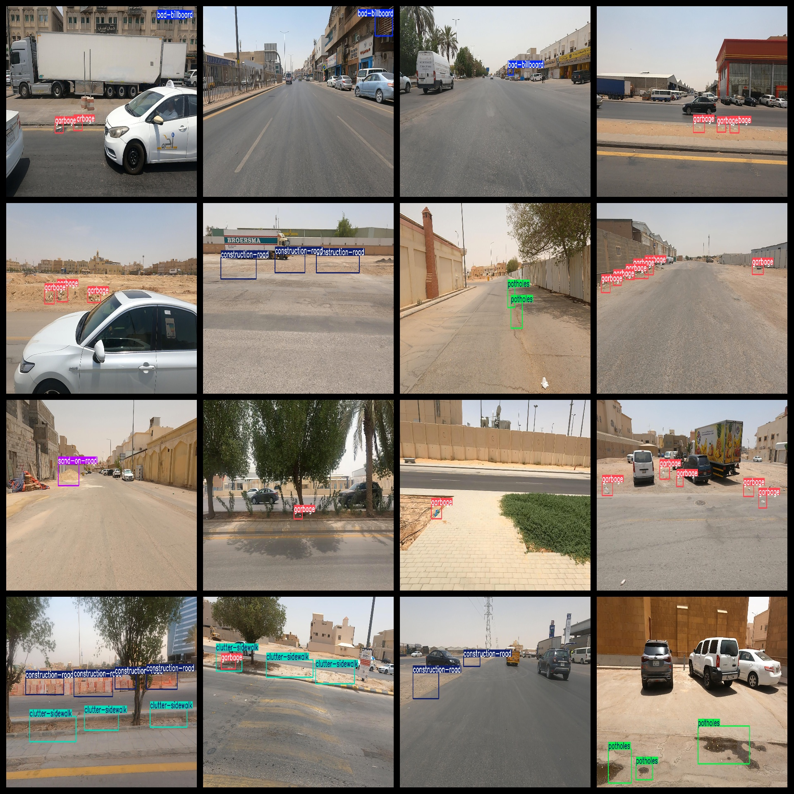
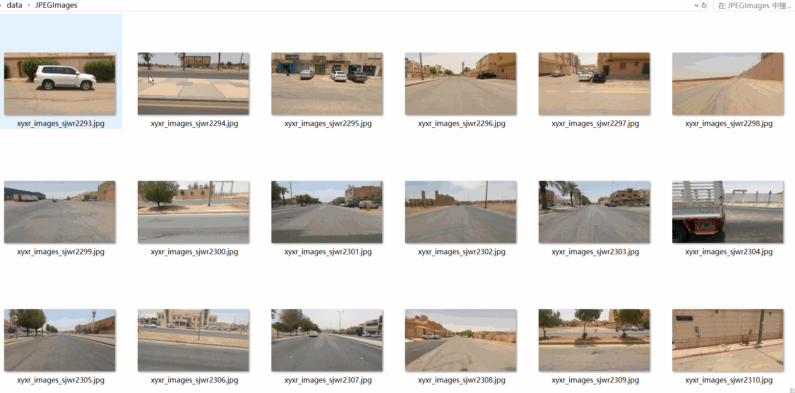

# Smart City Inspection Road Health Visual contamination Detection Dataset 7867 imagesVOC+YOLO format

Smart City Patrol Road Health Visual Pollution Detection Dataset 7867 VOC + YOLO Format

Dataset format: Pascal VOC format + YOLO format (the txt file does not contain the split path, it only contains jpg images and corresponding VOC format xml files and yolo format txt files)

Dataset format: Pascal VOC format + YOLO format (the txt file does not contain the split path, it only contains jpg images and corresponding VOC format xml files and yolo format txt files)

Number of images (number of jpg files): 7867

Number of xml files: 7867

Number of annotations (number of txt files): 7867

Number of categories: 11

The Github repository is: datasets_sl

["bad-billboard", "bad-streetlight", "broken-signage", "clutter-sidewalk", "construction-road", "faded-signage", "garbage", "graffiti", "potholes", "sand-on-road", "unkept-facade"]

Broken billboards, damaged streetlights, broken signs, sidewalk clutter, roadwork, faded signs, trash, graffiti, potholes on the road, roadside sand and mud, neglected exterior

Number of boxes labeled in each category:

Bad-billboard frame count = 1551

Bad-streetlight Frame Count = 1

broken-signage frame count = 83

The number of clutter-sidewalk frames is 2253.

construction-road frame count = 2714

The English translation is: "fade-signage frame count = 107"

Garbage Frame Count = 8596

graffiti frame count = 1123

The number of potholes is 2623.

Sand-on-road frame count = 747

The number of unkept-facade frames is 127.

Total Frames: 19925

Number of images per category:

Bad-billboard's possession of the number of images = 1007

Bad-streetlight Claims Image Count = 1

Broken-signage occupies 69 images.

Clutter-sidewalk has 1128 images.

The number of construction-road images = 1034

Fade-signage occupies = 82

Garbage occupies 3824 images.

Graffiti occupies the image count = 619

The number of potholes occupied by the image is 1135.

Sand-on-road occupies a total of 488 pictures.

Unkept-Facade occupies a total of 72 images.

Image resolution: 1920x1080

Use the labeling tool: labelImg

Dataset Augmentation: No

Rules for annotation: Draw a rectangle around the category.

Important note: The dataset does not have been divided into training, validation, and testing sets.

Special Disclaimer: This dataset does not guarantee the accuracy of the trained models or weight files.

Annotation and image details are as follows:

## Images

---

Here is a pay link on Stripe (https://buy.stripe.com/3cs8yP7sY87d0vu9AB). Please contact me lonlonago@foxmail.com after funding $89, and I will send you a complete data files, thank you!

